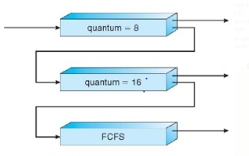

# Multi_Level_Queue
#### Three queues:

Q0 – RR with time quantum 8 milliseconds

Q1 – RR time quantum 16 milliseconds

Q2 – FCFS

## Scheduling

A new job enters queue Q0 which is served
FCFS

When it gains CPU, job receives 8
milliseconds

If it does not finish in 8 milliseconds, job is
moved to queue Q1

At Q1 job is again served FCFS and receives 16
additional milliseconds

If it still does not complete, it is preempted
and moved to queue Q2
